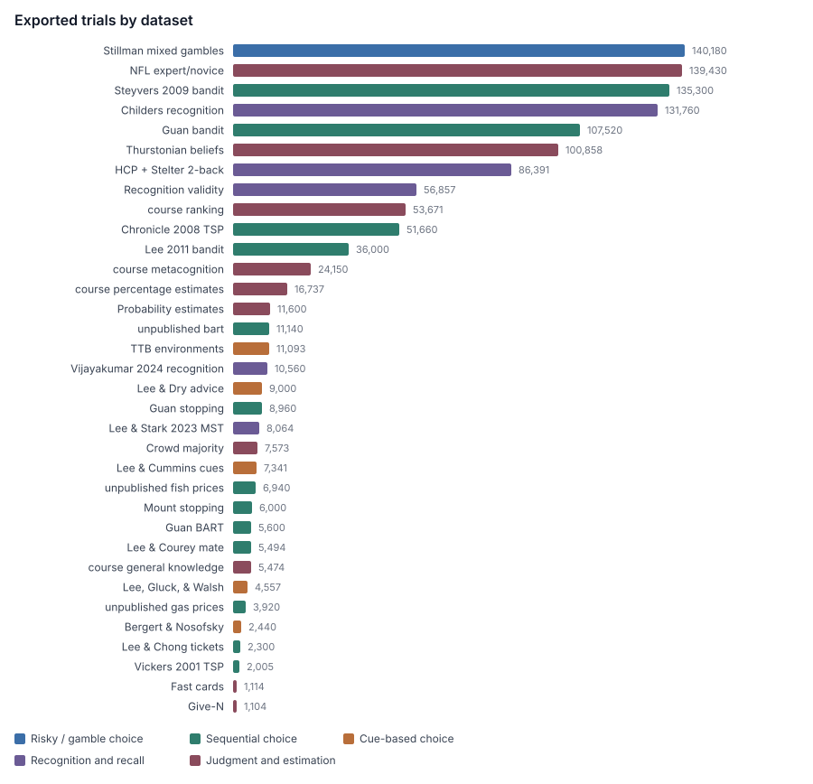

# behavioralDataRepository

Trial-level human behavioral datasets, mostly from studies associated with Michael D. Lee’s lab, exported as long-form **CSV**. Each dataset folder has its own README with task details, column definitions, sample size, and the citation to use.

`CATALOG.csv` is an index of every dataset in this repository.

## Datasets

### Risky / gamble choice

| Dataset | People | Trials | Task |
|---------|--------|--------|------|
| [Stillman, Krajbich, & Ferguson (2020)](datasets/risky-gamble-choice/stillman-et-al-mixed-gambles/) | 578 | 140,180 | Accept a 50/50 gain–loss (or gain-only) gamble, or take a certain amount |
| [Guan et al. (2020) described gambles](datasets/risky-gamble-choice/guan-et-al-2020-described-gambles/) | 56 | — | Left vs right described gambles (trials not archived; IDs match the other Guan 2020 tasks) |

### Sequential choice and sequential risk-taking

| Dataset | People | Trials | Task |
|---------|--------|--------|------|
| [Steyvers, Lee, & Wagenmakers (2009)](datasets/sequential-choice/steyvers-lee-wagenmakers-2009-bandit/) | 451 | 135,300 | Four-armed bandit |
| [Lee, Zhang, Munro, & Steyvers (2011)](datasets/sequential-choice/lee-zhang-munro-steyvers-2011-bandit/) | 10 | 36,000 | Two-armed bandit, three environments |
| [Guan et al. (2020) bandit](datasets/sequential-choice/guan-et-al-2020-bandit/) | 56 | 107,520 | Two-armed bandit (IDs shared with the other Guan 2020 tasks) |
| [Guan et al. (2020) BART](datasets/sequential-choice/guan-et-al-2020-bart/) | 56 | 5,600 | Balloon Analog Risk Task (IDs shared with the other Guan 2020 tasks) |
| [Guan et al. (2020) stopping](datasets/sequential-choice/guan-et-al-2020-optimal-stopping/) | 56 | 8,960 | Optimal stopping, lengths 4 / 8 (IDs shared with the other Guan 2020 tasks) |
| [Mount (2003)](datasets/sequential-choice/mount-2003-optimal-stopping/) | 50 | 6,000 | Optimal stopping, lengths 5 / 10 / 20 |
| [unpublished bart](datasets/sequential-choice/bart/) | 543 | 11,140 | Balloon Analog Risk Task (557 sessions; IDs shared with gasPrices / fishPrices) |
| [unpublished gas prices](datasets/sequential-choice/gasPrices/) | 196 | 3,920 | Cost-minimizing stopping, gas stations (W2023; IDs shared with bart) |
| [unpublished fish prices](datasets/sequential-choice/fishPrices/) | 344 | 6,940 | Cost-minimizing stopping, fish by weekday (W2024, F2025; IDs shared with bart) |
| [Lee & Chong (2024)](datasets/sequential-choice/lee-chong-2024-airline-tickets/) | 46 | 2,300 | Cost-minimizing stopping, airline tickets |
| [Lee & Courey (2021)](datasets/sequential-choice/lee-courey-2021-mate-selection/) | 55 | 5,494 | Value-maximizing stopping, mate selection |
| [Chronicle et al. (2008)](datasets/sequential-choice/chronicle-et-al-2008-tsp/) | 82 | 51,660 | Traveling salesperson tours |
| [Vickers et al. (2001)](datasets/sequential-choice/vickers-et-al-2001-tsp/) | 8 | 2,005 | Traveling salesperson tours |

### Cue-based multi-attribute choice

| Dataset | People | Trials | Task |
|---------|--------|--------|------|
| [Lee & Cummins (2004)](datasets/cue-based-multi-attribute/lee-cummins-2004/) | 60 | 7,341 | Two alternatives, six cues (take-the-best vs weighted additive) |
| [Bergert & Nosofsky (2007)](datasets/cue-based-multi-attribute/bergert-nosofsky-2007/) | 61 | 2,440 | Pairwise cue-based choice |
| [Lee & Dry (2006)](datasets/cue-based-multi-attribute/lee-dry-2006/) | 30 | 9,000 | Binary choice with an uncertain advisor |
| [Lee, Blanco, & Bo (2016)](datasets/cue-based-multi-attribute/lee-blanco-bo-2016-take-the-best/) | — | 11,093 | Take-the-best environments (no human choices) |
| [Lee, Gluck, & Walsh (2019)](datasets/cue-based-multi-attribute/lee-gluck-walsh-2019-switching/) | 38 | 4,557 | Two alternatives, four cues, aloud vs silent |

### Recognition and recall

| Dataset | People | Trials | Task |
|---------|--------|--------|------|
| [Childers et al. recognition SAT](datasets/working-memory-recognition/childers-recognition-sat/) | 80 | 131,760 | Word old/new recognition, speed vs accuracy |
| [Lee & Stark (2023)](datasets/working-memory-recognition/lee-stark-2023-mst/) | 21 | 8,064 | Study–test MST, old/new and old/similar/new |
| [Vijayakumar (2024)](datasets/working-memory-recognition/kannan-conditioned-recognition/) | 44 | 10,560 | Conditioned recognition with confidence (Kannan) |
| [Lee, Mistry, & Menon (2022)](datasets/working-memory-recognition/lee-mistry-menon-2022-nback/) | 1,143 | 86,391 | 2-back (Stelter–Degner and HCP extracts) |
| [Lee, Doering, & Carr (2019)](datasets/working-memory-recognition/lee-doering-carr-2019-recognition-validity/) | 270 | 56,857 | Recognition of paired names (several domains) |
| [RAVLT amyloid](datasets/working-memory-recognition/ravlt-amyloid/) | 200 | 6,000 | RAVLT old/new recognition counts (100 amyloid-negative, 100 amyloid-positive) |
| [Murdock (1962)](datasets/working-memory-recognition/murdock-1962-free-recall/) | — | aggregates | Free-recall serial-position counts (not trial-level) |

### Judgment and estimation

| Dataset | Task |
|---------|------|
| [Lee, Zhang, & Shi (2011)](datasets/judgment-and-estimation/lee-zhang-shi-2011-price-is-right/) | Price is Right showcase bids |
| [Lee & Shi (2010)](datasets/judgment-and-estimation/lee-shi-2010-small-group-woc/) | Small-group price estimates |
| [Lee, Steyvers, & Miller (2014)](datasets/judgment-and-estimation/lee-steyvers-miller-2014-rankings/) | Wisdom-of-crowd rankings |
| [Lee & Sarnecka (2011) Give-N](datasets/judgment-and-estimation/lee-sarnecka-2011-give-n/) | Give-N in children (IDs shared with fast-cards) |
| [Lee & Sarnecka (2011) fast-cards](datasets/judgment-and-estimation/lee-sarnecka-2011-fast-cards/) | Fast-cards in children (IDs shared with Give-N) |
| [Montgomery & Lee (2021)](datasets/judgment-and-estimation/montgomery-lee-2021-nfl/) | NFL win predictions, experts and novices |
| [Lee & Lee (2017)](datasets/judgment-and-estimation/lee-lee-2017-crowd-majority/) | Crowd majority vs accuracy (problem-level) |
| [Lee & Danileiko (2014)](datasets/judgment-and-estimation/lee-danileiko-2014-probability-estimates/) | Probability estimates, general knowledge and soccer |
| [Lee & Ke](datasets/judgment-and-estimation/lee-ke-thurstonian-beliefs/) | Thurstonian rankings of beliefs |
| [unpublished percentage estimation](datasets/judgment-and-estimation/percentageEstimation/) | Percentage estimates (course; IDs shared with bart / gasPrices / fishPrices) |
| [unpublished general-knowledge estimation](datasets/judgment-and-estimation/generalKnowledgeEstimation/) | Anchored and unanchored estimates (course; same IDs) |
| [unpublished metacognitive estimation](datasets/judgment-and-estimation/metaCognition/) | True/false capitals with confidence (course; same IDs) |
| [unpublished ranking](datasets/judgment-and-estimation/ranking/) | Partial rankings (course; same IDs) |

## Trial counts



Bar color is the dataset group. Stillman all studies is 140,180 rows; Study 1 gain–loss only is 24,420. NFL counts are expert plus novice predictions. Thurstonian beliefs and crowd-majority files are rankings or problem-level counts, not sequential trials. Take-the-best environments have no human choices. Murdock (1962) and the RAVLT amyloid extract are omitted. Source: `CATALOG.csv`.

## Related repositories

These datasets live in separate repositories and are not copied here.

| Repository | Contents |
|------------|----------|
| [categoryInvariance](https://github.com/mdlee/categoryInvariance) | 28 category-learning datasets (Danileiko & Lee, 2018); [OSF](https://osf.io/j95q6/) |
| [orientationModeling](https://github.com/mdlee/orientationModeling) | Visual working-memory orientation reproduction (Tomic & Bays, 2023; Ngiam & Lee, 2026) |
| [intertemporalChoice](https://github.com/mdlee/intertemporalChoice) | Delay discounting |
| [anchoringInTheYears](https://github.com/mdlee/anchoringInTheYears) | Event-year anchoring (Lee & Dang) and Barrera-Lemarchand Experiment 2 |
| [citizenFrogs](https://github.com/mdlee/citizenFrogs) | Frog identification judgments |
| [delayedRecognitionSpanTask](https://github.com/mdlee/delayedRecognitionSpanTask) | Marmoset delayed recognition span (choice and response time) |

## Citation

Cite the original paper for each dataset (see that folder’s README). If you use several datasets from this archive, a pointer to the repository is enough in addition to those papers.

## Layout

```
datasets/
  risky-gamble-choice/
  sequential-choice/
  cue-based-multi-attribute/
  working-memory-recognition/
  judgment-and-estimation/
scripts/     # rebuild CSVs and data.mat from the original source files
CATALOG.csv
figures/     # trial-count chart used in this README
```

Column names and MATLAB fields are **camelCase**. Each dataset folder has a `data.mat` whose only variable is a struct `d`.

Participant identifiers are anonymous integers. When a paper or course collected more than one task from the same people, those tasks live in separate folders but use the **same `participant` IDs** so they can be joined (see each folder’s README). Course datasets are de-identified; raw survey exports with names, student IDs, or IP addresses are not included.
